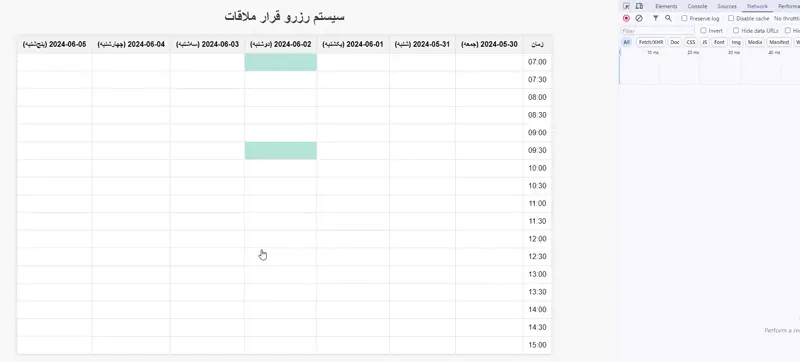

# Appointment Scheduler

This project is a simple appointment scheduling system built with PHP, Nginx, MySQL, and Docker. It allows users to reserve and cancel appointments.




## Features

- Users can view available appointment slots.
- Users can reserve appointments.
- Users can cancel their reserved appointments.
- Appointments are stored in a MySQL database.

## Requirements

- Docker
- Docker Compose
- PHP 8.3 or higher
- Composer

## Installation

### Clone the Repository

```sh
git clone <repository_url>
cd appointment_scheduler
```

### Set Up Environment Variables
```sh
copy .env.example .env
```

### Build and Run with Docker Compose
```sh
cd docker
docker-compose --env-file ../.env up --build
```
